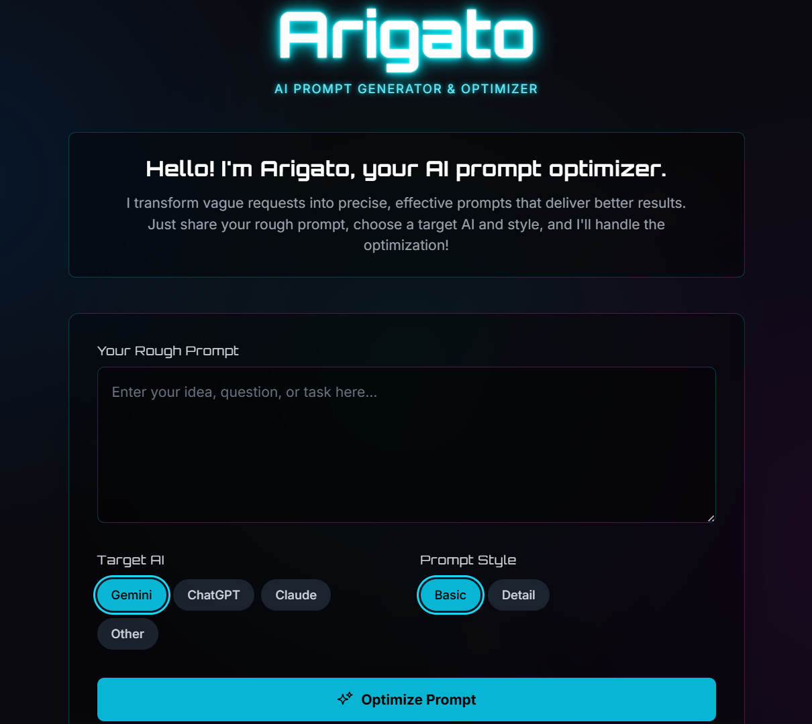
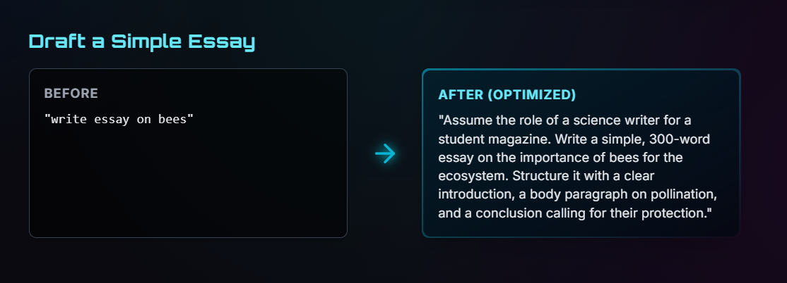
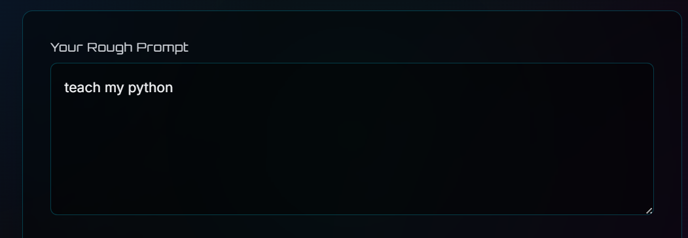
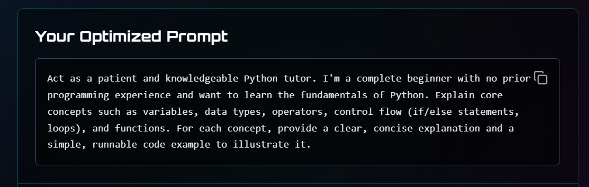

# Arigato: AI Prompt Generator and Optimizer 🤖✨

## Arigato is a smart web app that helps turn your not-so-clear ideas into really good prompts for any AI. It helps you get the most out of AI by making sure the AI understands what you want.

**🚀 The Problem**

AI can do amazing things, but it only works well if you give it a good prompt. Writing a good prompt is tricky. It needs to be clear, have context, and be structured. Many people find it hard to say what they need, so they get results that aren’t very good.

**💡 The Solution**

Arigato is like your personal helper for prompts. It uses the Google Gemini API to take your rough ideas and make them better using a special method. The result is a great prompt that you can use with different AI models like Gemini, ChatGPT, and Claude.

## ✨ Key Features

- **Smart Prompt Improvement:** Uses the Gemini API and a special "4-D Method" to make your prompts better.
- **Choose Your AI:** It can tailor prompts for different AI models.
- **Different Styles:** You can pick a quick fix or a more detailed improvement.
- **Easy to Understand:** It tells you why your prompt is better and gives tips.
- **Nice Interface:** It looks good and is easy to use, with a cool dark mode.
- **Examples:** You can see how a simple question becomes a great prompt.
- **Copy and Use:** You can copy the prompt and use it right away.

## 🧠 How It Works: The 4-D Method

Arigato uses a special 4-D method to make your prompts better:

1. **Break It Down:** It looks at what you wrote and figures out the main idea, important parts, and what you want.
2. **Check for Problems:** It finds any unclear parts or weak spots.
3. **Make It Better:** It uses special techniques to fix the problems.
4. **Give You the Result:** It shows you the final prompt and explains what it did.

This method makes sure your prompt is not just rewritten, but made much better.

## Working Examples Screenshots

**🛠️ Tech Stuff**

- **Frontend:** Made with React and TypeScript.
- **AI Engine:** Uses the Google Gemini API.
- **Styling:** Looks nice with Tailwind CSS.
- **Icons:** Custom pictures.
- **Hosting:** Can be put on any website host like Vercel, Netlify, or GitHub Pages.

**⚙️ Getting Started**

## Run On Cloud 
**using google cloud or gemini api key
---

## Run Locally

**Prerequisites:**  Node.js

1. Install dependencies:
   `npm install`
2. Set the `GEMINI_API_KEY` in [.env.local](.env.local) to your Gemini API key
3. Run the app:
   `npm run dev`
